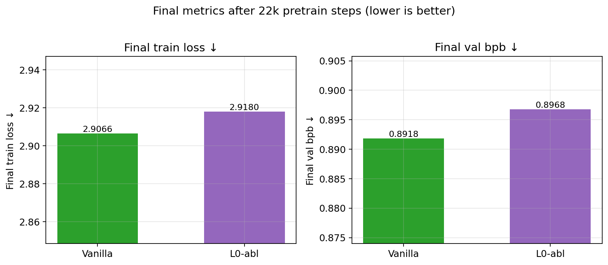
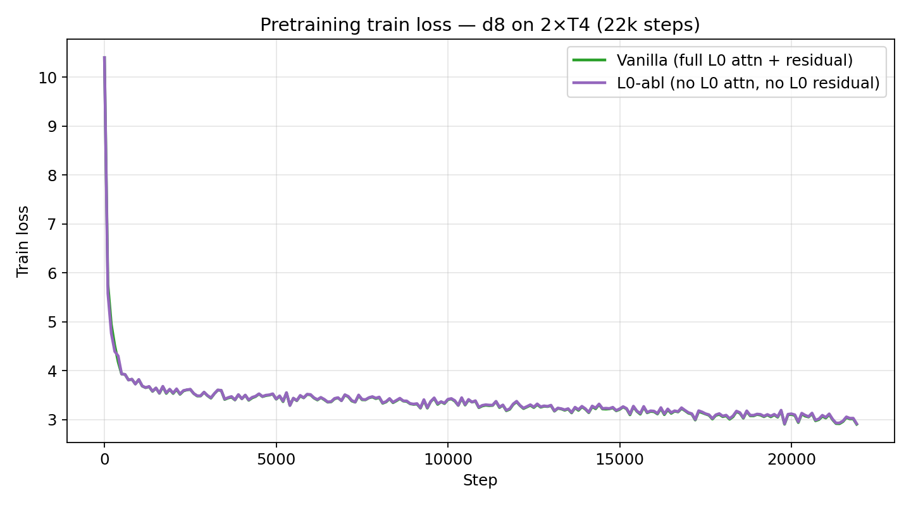
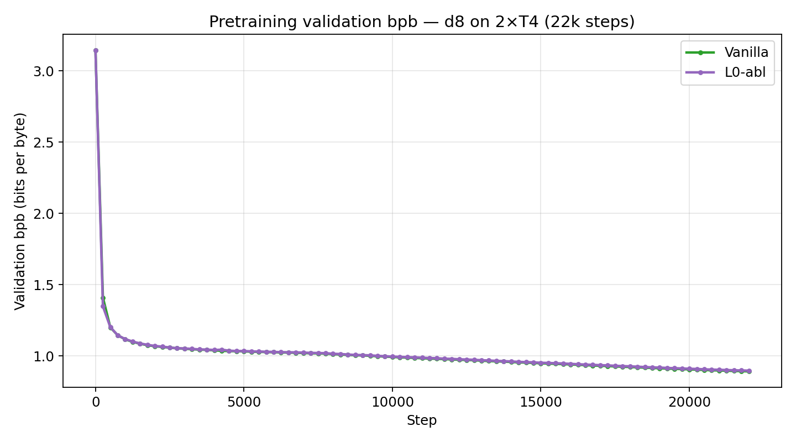
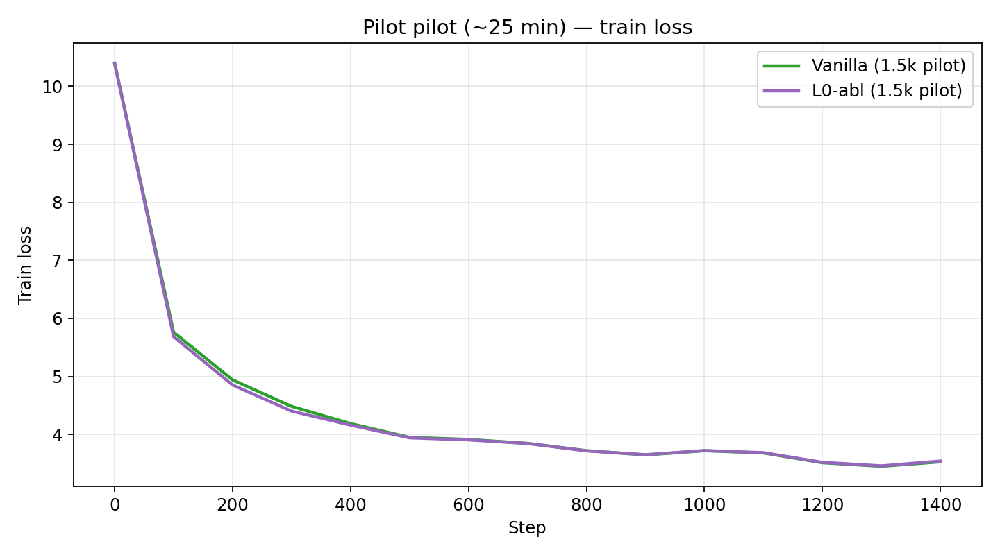

# Layer-0 Attention & Residual Ablation on nanochat

**Author:** [Priyanshu-5257](https://github.com/Priyanshu-5257)  
**Status:** pretraining ablation study (completed)  
**Base code:** [karpathy/nanochat](https://github.com/karpathy/nanochat) (forked experiment branches)

This repo documents a controlled ablation: **remove multi-head attention and residual connections from layer 0 only**, and compare against the **vanilla** nanochat GPT stack under identical training conditions.

---

## 1. Intuition

Standard decoder transformers look like:

```text
x₀ → [ Attn residual ] → [ MLP residual ] → x₁ → … → x_L
```

Each block typically does:

```text
x ← x + Attn(Norm(x))
x ← x + MLP(Norm(x))
```

**Why ablate layer 0?**

| Hypothesis | Idea |
|------------|------|
| **H1 — Early mixing matters** | Layer 0 is the first place tokens can attend to each other. Removing L0 attention forces the model to start with a **token-local** transform (MLP only). |
| **H2 — Residuals stabilize depth** | Residual (skip) connections keep the stream as “identity + small update.” Removing them on L0 forces a **pure rewrite** of the representation. |
| **H3 — Later layers can compensate** | Layers 1…L−1 still have full attention + residuals, so the model might recover. If it **doesn’t fully recover**, L0 attn+residual were doing real work. |

**Prediction:** L0 ablation should be **slightly worse** (higher train loss and val bpb) if L0 attention + residual are useful — not catastrophic if later layers compensate.

---

## 2. What we changed

### Vanilla block (all layers)

```text
x = x + Attn(Norm(x))
x = x + MLP(Norm(x))
```

### Ablated layer 0 only

```text
# no attention
# no residual
x = MLP(Norm(x))
```

Layers **1 … depth−1** stay vanilla.

Implementation lived on experiment branches of the code fork:

| Variant | Branch / idea |
|---------|----------------|
| Vanilla | `master` of the training fork |
| L0-abl | `exp/layer0-no-attn-no-resid` |

Code reference (training harness): https://github.com/hbpkillerX-5257/nanochat

---

## 3. Experimental setup (identical for both)

| Item | Value |
|------|------:|
| Model depth | **8** (`d8`) |
| Sequence length | 1024 |
| Device batch size | 4 per GPU |
| GPUs | **2× NVIDIA T4** (Kaggle) |
| Global batch | 65,536 tokens |
| Precision | **fp16** (`NANOCHAT_DTYPE=float16`) |
| Pretrain steps | **22,000** (~5–6 hours) |
| Data | ClimbMix shards (nanochat pretrain mix) |
| Metric | train CE loss + **val bpb** (bits/byte) |

Pilot runs (1,500 steps, ~25 min) were used first to sanity-check the ablation before the long runs.

---

## 4. Results

### 4.1 Final metrics (22k steps)

| Architecture | Train loss ↓ | Val bpb ↓ | Wall time |
|--------------|-------------:|----------:|----------:|
| **Vanilla** | **2.907** | **0.892** | ~6.0 h |
| **L0-abl** | 2.918 | 0.897 | ~5.7 h |
| **Δ (abl − van)** | **+0.011** | **+0.005** | slightly faster |

**Vanilla wins on both train and validation.** The gap is small but **consistent in direction**.



### 4.2 Train loss curves



Both curves drop quickly, then improve slowly. After the early phase, **L0-abl sits slightly above vanilla** (higher loss).

### 4.3 Validation bpb curves



Validation tracks the same story: **L0-abl ≥ vanilla** throughout the long run (worse or equal, never clearly better).

### 4.4 Pilot (~1.5k steps)

Same ordering already visible in the short pilot:

| | Train loss | Val bpb |
|--|-----------:|--------:|
| Vanilla | 3.529 | 1.040 |
| L0-abl | 3.541 | 1.042 |



---

## 5. Interpretation

1. **Removing L0 attention + residual does not break training** — loss decreases smoothly; no collapse.
2. **It does not help** — on this setup, ablation is uniformly a bit worse on train **and** val.
3. That supports the simple claim: **layer-0 multi-head attention and residual connections contribute positively** to next-token modeling at d8 / ClimbMix scale.
4. The effect size is **modest** (+0.01 train loss, +0.005 val bpb at 22k steps). Later full blocks partly compensate, but not completely.
5. Because **val** is worse too (not only train), this is unlikely to be “just train-curve noise.”

### What this does *not* claim

- Does **not** prove L0 attention is always required at all scales.
- Does **not** separate “no attention” vs “no residual” (they were removed **together**).
- Does **not** include a finished SFT / chat eval comparison (SFT was unstable/incomplete in these sessions).

---

## 6. Architecture sketch

```text
Vanilla d8                          L0-abl d8
─────────                           ────────
embed + smear                       embed + smear
L0: Attn+res → MLP+res              L0: MLP only (no Attn, no res)
L1: Attn+res → MLP+res              L1: Attn+res → MLP+res
…                                   …
L7: Attn+res → MLP+res              L7: Attn+res → MLP+res
lm_head                             lm_head
```

---

## 7. Reproducing / data

Raw W&B export used for plots:

- `results/data/metrics.json` — histories + summaries for pilot and 22k runs

Primary long runs (W&B):

| Name | Link |
|------|------|
| Vanilla 22k | https://wandb.ai/hbpkillerx/nanochat/runs/kk2bdl2w |
| L0-abl 22k | https://wandb.ai/hbpkillerx/nanochat/runs/ixxaq73z |

Training entrypoint used on Kaggle: `runs/kaggle_t4x2.py` in the code fork.

---

## 8. Repo layout

```text
.
├── README.md                 # this writeup
├── configs/                  # training config snapshot
├── docs/                     # extra notes
├── results/
│   ├── data/metrics.json     # exported histories
│   └── plots/                # figures used above
└── LICENSE
```

---

## 9. Citation / credit

- Training stack derived from **Andrej Karpathy’s** [nanochat](https://github.com/karpathy/nanochat).
- Ablation design, Kaggle runs, analysis, and this report: **Priyanshu-5257**.

```bibtex
@misc{maurya2026l0ablation,
  author = {Priyanshu Maurya},
  title  = {Layer-0 Attention and Residual Ablation on nanochat},
  year   = {2026},
  url    = {https://github.com/Priyanshu-5257/nanochat-l0-ablation-study}
}
```

---

## License

MIT — see [LICENSE](LICENSE).
