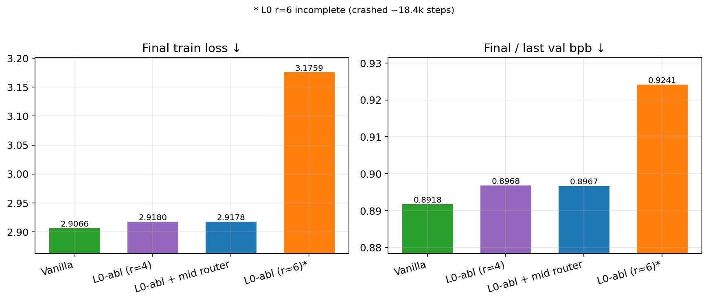
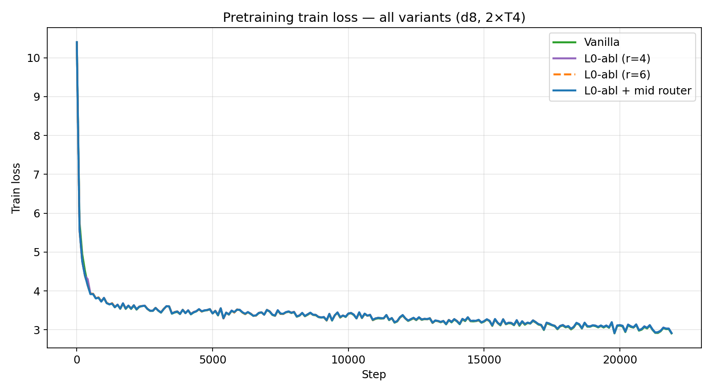
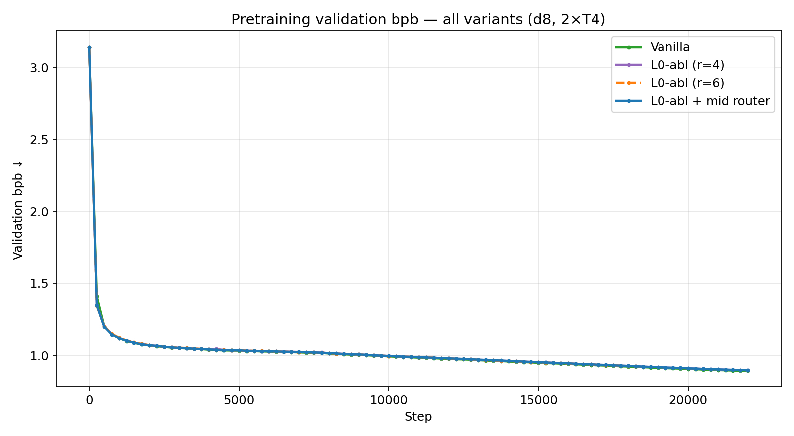
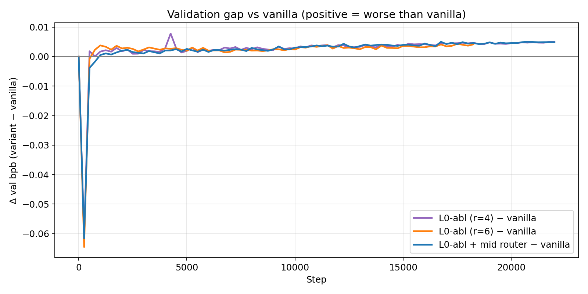

# Layer-0 Ablations on nanochat

**Author:** [Priyanshu-5257](https://github.com/Priyanshu-5257)  
**Base stack:** [karpathy/nanochat](https://github.com/karpathy/nanochat)  
**Code forks used for training:** [hbpkillerX-5257/nanochat](https://github.com/hbpkillerX-5257/nanochat)  
**Hardware:** Kaggle **2× NVIDIA T4**, fp16

This repo is a **results report** (not the full trainer). It compares **vanilla nanochat** against **three layer-0 experiments** under the same d8 pretrain recipe.

---

## Experiments at a glance

| ID | Name | What changes | Branch | Status |
|----|------|--------------|--------|--------|
| **V** | **Vanilla** | Full stack | `master` | ✅ 22k steps |
| **E1** | **L0-abl (r=4)** | Layer 0: **no attention, no residual**, MLP ratio **4** | `exp/layer0-no-attn-no-resid` | ✅ 22k steps |
| **E2** | **L0-abl (r=6)** | Same as E1, but L0 MLP ratio **6** (param reinvestment) | `exp/layer0-no-attn-no-resid-mlp6` | ⚠️ crashed ~18.4k |
| **E3** | **L0-abl + mid router** | E1 + **middle layer** `AttnBypassRouter` (per-token gate: use attn or skip) | `exp/layer0-no-attn-mid-router` | ✅ 22k steps |

---

## 1. Intuition

A normal decoder block is:

```text
x ← x + Attn(Norm(x))     # token mixing + residual
x ← x + MLP(Norm(x))      # channel mixing + residual
```

**Layer 0** is special: it is the first nonlinear stage after embeddings. We asked:

> Can we delete early attention (and residual), and still match vanilla quality — maybe by widening the MLP, or by learning when later attention is needed?

| Experiment | Hypothesis |
|------------|------------|
| **E1 — no L0 attn / no L0 residual (MLP r=4)** | Early mixing might be redundant; a pure token-wise MLP rewrite may be enough before deeper layers mix. Cheaper, smaller KV cache. |
| **E2 — same + MLP r=6** | Maybe E1 only failed because of **fewer parameters**. Reinvest attention params into a wider L0 MLP (≈ `12 d²` block budget again). If quality still lags, the issue is **missing token mixing**, not parameter count. |
| **E3 — mid-layer attn router** | Keep E1 at L0, but at the **middle layer** learn a **binary-ish gate**: per token, blend in attention residual or skip it. Maybe the model only needs attention sometimes / on some tokens. |

**Prediction:** If early token mixing matters, **E1/E2/E3 all stay slightly worse than vanilla on val bpb**. If width fixes it, **E2 ≈ vanilla**. If dynamic attention helps, **E3 > E1**.

---

## 2. Architectures

### Vanilla (V)

All layers:

```text
x = x + Attn(Norm(x))
x = x + MLP_r4(Norm(x))
```

### E1 — L0 ablation, MLP ratio 4

```text
L0:  x = MLP_r4(Norm(x))          # NO attn, NO residual
L1+: x = x + Attn(Norm(x))
     x = x + MLP_r4(Norm(x))
```

### E2 — L0 ablation, MLP ratio 6 (param-matched)

```text
L0:  x = MLP_r6(Norm(x))          # wider MLP; still no attn / no residual
L1+: same as vanilla
```

Motivation: full MHA block ≈ `4d²` (attn) + `8d²` (MLP r=4) = `12d²`.  
L0 with r=6 MLP only ≈ `2 × 6 d² = 12d²` → **same parameter budget** as a full block, but **no token mixing**.

### E3 — L0 ablation + middle-layer attention bypass router

```text
L0:       same as E1 (MLP-only, no residual)
L_mid:    gate = σ(Router(x[..., :32]))     # scalar in (0,1) per token
          x = x + gate * Attn(Norm(x))      # soft on/off attention residual
          x = x + MLP_r4(Norm(x))
other L:  vanilla
```

Router is tiny (`Linear(32 → 1)` + bias), trained with AdamW (not Muon). Bias init ≈ +2 so gates start **mostly ON** (use attention).

```text
Vanilla d8                 E1 / E2                         E3
─────────                  ──────                          ──
embed                      embed                           embed
L0: Attn+res, MLP+res      L0: MLP only (r=4 or r=6)       L0: MLP only (r=4)
L1..L3: full               L1..L3: full                    L1..L3: full
L4: full                   L4: full                        L4: gated Attn residual
L5..L7: full               L5..L7: full                    L5..L7: full
lm_head                    lm_head                         lm_head
```

---

## 3. Shared training recipe

| Item | Value |
|------|------:|
| Depth | **8** |
| Seq len | 1024 |
| Microbatch | 4 / GPU |
| GPUs | 2× T4 |
| Global batch | 65,536 tokens |
| Steps (target) | **22,000** |
| Dtype | fp16 |
| Data | ClimbMix (nanochat shards) |

Only the architecture differs across V / E1 / E2 / E3.

---

## 4. Results

### 4.1 Final metrics

| Variant | Steps | Train loss ↓ | Val bpb ↓ | Δ val vs vanilla | Wall time |
|---------|------:|-------------:|----------:|-----------------:|----------:|
| **V Vanilla** | 22,000 | **2.907** | **0.8918** | — | ~6.0 h |
| **E1 L0 r=4** | 22,000 | 2.918 | 0.8968 | **+0.0050** | ~5.7 h |
| **E3 L0 + mid router** | 22,000 | 2.918 | 0.8967 | **+0.0049** | ~6 h |
| **E2 L0 r=6** | **18,400*** | 3.176* | 0.9241* | worse mid-run; run incomplete | crashed |

\*E2 crashed before 22k; last logged metrics are not directly comparable as a “finished” score. Trajectory through ~16–18k already tracked E1 (did **not** catch vanilla).



### 4.2 Train loss (all)



All variants learn; after the early drop, **vanilla stays lowest**. E1 and E3 nearly overlap. E2 (dashed) incomplete.

### 4.3 Validation bpb (all)



Same ordering on the metric that matters for fair LM quality: **vanilla best**, then E1 ≈ E3, E2 not better.

### 4.4 Gap vs vanilla (val bpb)



Positive = worse than vanilla. After ~step 500, ablations sit **above zero** and stay there.

---

## 5. Interpretation

### E1 — L0 no attn / no residual (r=4)

- **Works** (stable training, smooth curves).
- **Slightly worse** final quality: **+0.005 val bpb**.
- Modestly **faster** train (~+5% tok/s in earlier analysis) and **one fewer KV layer**.
- Not a free win: quality cost is real and systematic on both train and val.

### E2 — param-matched MLP r=6

- **Does not fix** the regression vs vanilla (trajectory stays with E1, not V).
- Supports: the missing ingredient is **token mixing / residual structure**, not raw L0 parameter count.
- Run **crashed ~18.4k** (incomplete final number); conclusion uses matched mid-run behavior + incomplete end state.

### E3 — mid-layer attention router

- Finishes 22k; **almost identical to E1** (val bpb 0.8967 vs 0.8968).
- Router **does not recover vanilla** and **does not clearly beat plain E1**.
- At this scale, a soft per-token gate on middle attention is not enough to offset the L0 ablation.

### Bottom line

| Claim | Supported? |
|-------|------------|
| L0 attn+residual can be removed without collapse | ✅ |
| Removing them is free (same quality) | ❌ |
| Extra MLP width buys back quality | ❌ (E2) |
| Learnable mid-attn routing buys back quality | ❌ (E3 ≈ E1) |
| Vanilla still best under this recipe | ✅ |

---

## 6. W&B runs (public)

Project visibility is set to **open** (`USER_READ`) so run pages are readable without a private invite:

- Project: [wandb.ai/hbpkillerx/nanochat](https://wandb.ai/hbpkillerx/nanochat)

| Variant | Run name | ID | Link |
|---------|----------|-----|------|
| Vanilla | `my-kaggle-d8` | `kk2bdl2w` | [open run](https://wandb.ai/hbpkillerx/nanochat/runs/kk2bdl2w) |
| E1 L0 r=4 | `my-kaggle-d8-L0-abl` | `ixxaq73z` | [open run](https://wandb.ai/hbpkillerx/nanochat/runs/ixxaq73z) |
| E2 L0 r=6 | `my-kaggle-d8-L0-abl` | `8l97e3oj` | [open run](https://wandb.ai/hbpkillerx/nanochat/runs/8l97e3oj) (crashed) |
| E3 mid router | `layer0-no-attn-mid-router` | `znruy3o5` | [open run](https://wandb.ai/hbpkillerx/nanochat/runs/znruy3o5) |

**Self-contained backup (no W&B required):** full histories are vendored in  
[`results/data/metrics.json`](results/data/metrics.json) and all figures under [`results/plots/`](results/plots/).  
Regenerate plots: `python scripts/make_plots.py`.

---

## 7. Repo layout

```text
.
├── README.md
├── LICENSE
├── configs/pretrain_d8_kaggle.json
├── docs/method.md
├── results/
│   ├── data/metrics.json
│   └── plots/          # figures embedded above
└── scripts/make_plots.py
```

---

## 8. Limitations

- Joint ablation of **attn + residual** on L0 (not fully factorial).
- E2 incomplete (crash).
- Single seed, single scale (d8 / ClimbMix / 2×T4).
- SFT / chat eval not completed for fair comparison.
- Router utilization stats (how often gate is on/off) not logged in these runs.

---

## Citation

```bibtex
@misc{maurya2026l0ablations,
  author = {Priyanshu Maurya},
  title  = {Layer-0 Attention Ablations on nanochat},
  year   = {2026},
  url    = {https://github.com/Priyanshu-5257/nanochat-l0-ablation-study}
}
```

Training stack credit: **Andrej Karpathy / nanochat**.  
Ablation design, runs, and this report: **Priyanshu-5257**.

## License

MIT — see [LICENSE](LICENSE).
